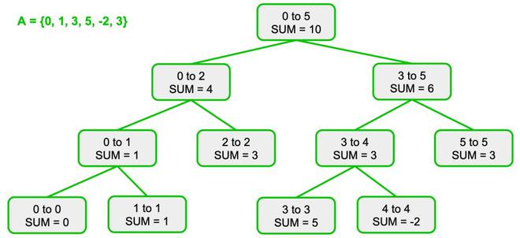
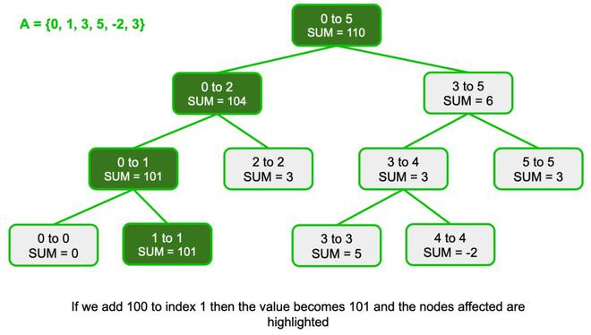
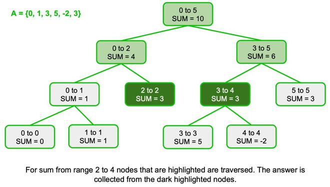

# Segment Tree


## Related Leetcode problems
- [Fruits basket III](https://leetcode.com/problems/fruits-into-baskets-iii/description/)


## Usage
- range queries like finding min/max/sum over a specifc range of elements in an array
- The tree is built recursively by dividing the array into segments until each segment represents a single element. 


## Functions
- [build](#build) : build a segment tree
- [point update](#point-update): update some value of a node
- [query](#query): query from a range 


```python
# global vars
A = []       # original array 
ST = []      # segment tree
```

### Build 


The build operation uses divide-and-conquer method, with similar approach with BST. 

We try to build node that will contain sum of A[left:right]



```python
# Building segment tree (O(N) time)
# node: index of ST to be calculated
# L, R: indices of A
# ST[node] will contain sum of A[l:r]
def build(node, L, R):

    if L == R:
        ST[node] = A[L]
    else:
        mid = (L+R)//2

        build(2*node, L, mid)
        build(2*node+1, mid+1, R)

        # storing sum of both children into parent 
        ST[node] = ST[2*node] + ST[2*node+1]
```


### Point Update

If we update A[i] to another value, the segment tree values should also be updated as well (i.e intervals that contains A[i])




```python
# Given index, idx, update A[idx] += val - OlogN 
def update(node, L, R, idx, val):
    
    if L == R:
        A[idx] += val 
        ST[node] += val 
    else:

        mid = (L+R)//2

        # if idx in the left => update in the left
        if L <= idx and idx <= mid:
            update(2*node, L, mid, idx, val)
        else:
            update(2*node+1, mid+1, R, idx, val)

        # Store information in ST parent 
        ST[node] = ST[2*node] + ST[2*node + 1]
```


### Query


For query, using indices we can know which child node to traverse to



```python
# Find sum of segment A[tl:tr] - OlogN
# l, r: leftmost and rightmost indices of A
def query(node, tl, tr, l, r):

    # out of range 
    if r < tl or tr < l:
        return 0
    
    # if the node fully contain the range 
    if l <= tl and tr <= r:
        return ST[node]
    
    # if the node partially contains the range 
    tm = (tl + tr)//2

    return query(2*node, tl, m, l, r) + query(2*node+1, m+1, tr, l, r)

    
```


## References 
https://www.geeksforgeeks.org/dsa/introduction-to-segment-trees-2/


