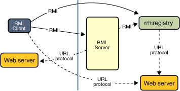

# RMI Applications

## Overview
RMI applications consists of 2 programs: **server** and **client**. 
- **server program** creates remote objects, makes references to these objects accessible 
- **client program** obtains a remote reference to >=1 remote objects on a server and invoke methods on them 

RMI allows these programs communicate.

**RMI application uses RMI registry to obtain reference to a remote object**

The server calss the registry to associate a name with a remote object. The client looks up the remote object by its name in the server's registry then invokes method on it.

RMI system uses an existing webserver to load class definitions, from server to client and vice versa, for objects when needed. 

## Remote Interfaces, Objects and Methods

Remote objects: objects with methods that can be invoked across JVM 
- Extends interface `java.rmi.Remote`
- Each method of the interface declares `java.rmi.RemoteException` in its `throws` clause

>**stub**: local representative/proxy for the remote object in the receiving >machine (rather than the JVM make another copy of the implementation). The client invokes methods on the local stub, which is responsible for carrying out the method invocation on the remote object.
>-> share same set of remote interfaces with remote object. 

## Creating Distributed Applications with RMI
General steps:
1. Designing and implementing components of distributed applications
2. Compiling sources
3. Making classes network accessible
4. Starting the application 

### 1. Designing and implementing components of distributed applications
Define which components are local or remote objects 
- Define remote interfaces: specify methods that can be invoked remotely
- Implement remote objects: remote object implement remote interfaces 
- Implement client: client uses remote objects can be implemented at any time after the remote interfaces are defined, even after remote objects are deployed.

### 2. Compiling source 
Similar to other Java program, `javac` is used ot compile source files. Source files contain the declarations of the remote interfaces, implementations, and any other server classes and client classes. 

### 3. Making classes network accessible 
Make class definitions network accessible, typically via web server. 

### 4. Starting the application
Running the RMI remote object registry, the server, and the client.  

# Reference
[Oracle RMI Applications](https://docs.oracle.com/javase/tutorial/rmi/overview.html)

